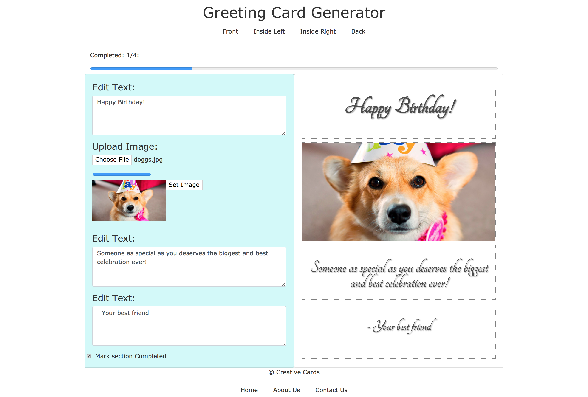
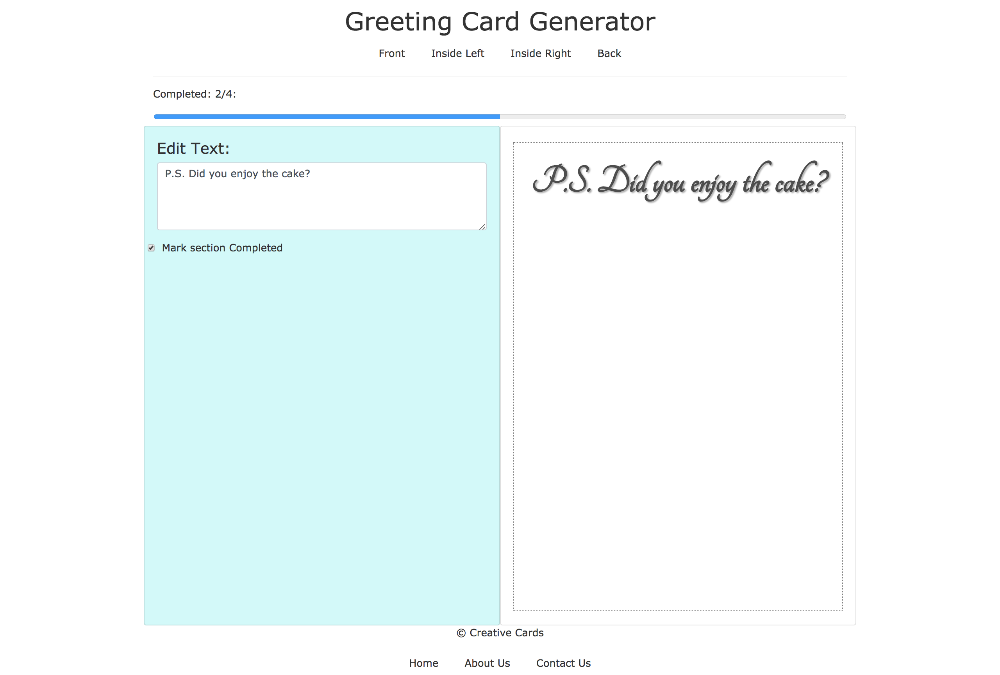
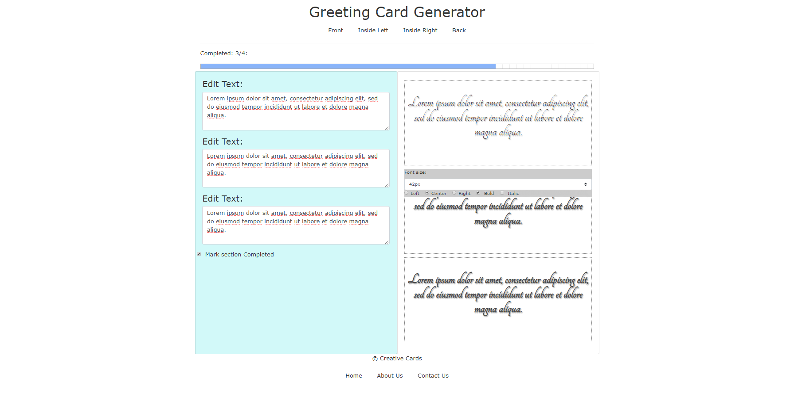
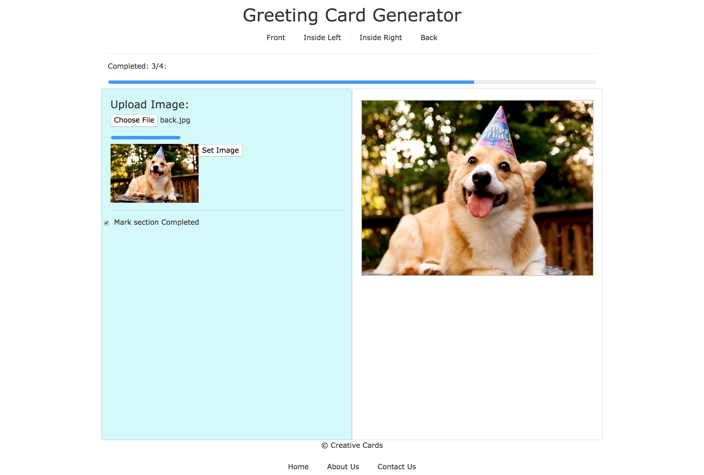

# Greeting Card Generator

> A front-end heavy Vue.js app that helps you preview what a custom made greeting card for whatever special occasion would look like. Birthday, Valentines, Christmas, Anniversay, whatever!

App built with Vue.js, Javascript, HTML, CSS, Bootstrap, and Google Firebase for storing images.

This app has been deployed to heroku: https://greeting-card-generator.herokuapp.com/

## Build Setup

``` bash
# Install dependencies
npm install

# Create firebaseConfig.js
cd './src/config'
cp firebaseConfigExample.js ./firebaseConfig.js

# Replace apiKey: "YOUR_API_KEY" in firebaseConfig.js with your Google Firebase API key for via your web apps
open firebaseConfig.js

# build dist folder & build.js for server production
npm run build

# launches express server and serves app at http://localhost:5000/
npm run start
```
# Images




